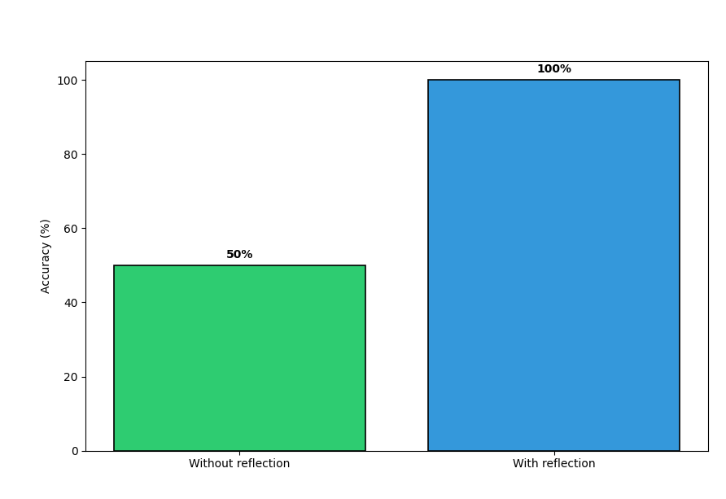

# 🧠 Reflection with External Feedback: Why LLMs Get Smarter When They Can Check Themselves

Large Language Models (LLMs) are powerful, but they are not reliable reasoners by default.  
They often produce answers that *sound confident but are wrong*, especially for tasks involving logic, constraints, or edge cases.

In this post, I’ll show a **small, reproducible experiment** that demonstrates why:

> 👉 *Reflection combined with external feedback dramatically improves LLM accuracy compared to pure prompting.*

We compare:
- ❌ LLM without reflection (pure prompting)
- ✅ LLM with reflection + external verification

---

## 🎯 Problem Setup: Kth Largest Element

We ask the LLM:

> Given a list of integers and a number `k`, return the kth largest element in the array.  
> If it's not possible to find the kth largest element, return `-1`.

This is intentionally simple, yet it exposes typical LLM failure modes:
- Off-by-one errors  
- Incorrect sorting  
- Failure on edge cases (`k > len(array)`)  

---

## 🧪 Baseline: LLM Without Reflection (Pure Prompting)

```python
PROMPT_TEMPLATE = """
{prefix}
Given a list of integers and a number k, return the kth largest element in the array.
If it's not possible to find the kth largest element, return -1.
Array: {nums}
K: {k}"""
```

**Observed behaviour:**
- Sometimes correct
- Often fails on edge cases

Accuracy observed: **~50%**

---

## 🔁 Adding Reflection with External Feedback

We introduce a deterministic verifier:

```python
def check_kth_largest_element(nums_array: list[int], k: int, llm_response: KthLargestElement) -> bool:
    sorted_nums = sorted(nums_array, reverse=True)
    k_th_largest_element = sorted_nums[k - 1] if 1 <= k <= len(sorted_nums) else -1
    return k_th_largest_element == llm_response.kth_largest_element
```

This function acts as a **ground-truth oracle**.  
The model is no longer trusted blindly.

---

## 🪞 Reflection Prompt

```python
def make_prefix_prompt(previous_output: KthLargestElement) -> str:
    return f"""
    Your previous output was incorrect. Try again.
    Previous output: {previous_output.kth_largest_element}
    """
```

This enables a simple loop:

1. Generate answer  
2. Verify externally  
3. Reflect failure  
4. Retry  

This is the core of **agentic behaviour**.

---

## 📊 Results

Below is the accuracy comparison from the experiment:



| Setup              | Accuracy |
|--------------------|----------|
| Without reflection | 50%      |
| With reflection    | 100%     |

Reflection + external feedback **doubles accuracy** by closing the loop between the model and the environment.

---

## 🧠 Why This Works

Pure prompting:
- No notion of correctness  
- No learning from failure  

Reflection + external feedback:
- Adds a verifier (critic)  
- Enables iterative improvement  
- Produces more reliable outputs  

This mirrors how humans solve problems:
> Try → Check → Reflect → Fix

---

## 🤖 This Pattern Powers Agentic Systems

This tiny example is the foundation of:
- ReAct agents  
- Tool-using LLMs  
- Self-correcting pipelines  
- Critic/Verifier architectures  

---

## 🧩 Full Reproducible Code

```python
import warnings
warnings.filterwarnings("ignore")
from dotenv import load_dotenv
from langchain_openai import ChatOpenAI
from langchain_core.messages import SystemMessage, HumanMessage
from langchain_ollama import ChatOllama
from pydantic import BaseModel, Field
from typing import cast
import matplotlib.pyplot as plt

class KthLargestElement(BaseModel):
    kth_largest_element: int = Field(description="The kth largest element in the array")

load_dotenv()

SEED = 42
openai_model = "llama3:8b"
llm = ChatOllama(model=openai_model, seed=SEED).with_structured_output(KthLargestElement)

test_set = [
    {"nums": [3, 2, 1, 5, 6, 4], "k": 3, "expected": 4},
    {"nums": [3, 2, 1, 5, 6, 4], "k": 6, "expected": 1},
    {"nums": [3, 2, 1, 5, 6, 4], "k": 7, "expected": -1},
    {"nums": [1,2,3,4,5,6,7,8,9,10], "k": 1, "expected": 10},
    {"nums": [1,2,3,4,5,6,7,8,9,10], "k": 10, "expected": 1},
    {"nums": [1,2,3,4,5,6,7,8,9,10], "k": 11, "expected": -1},
]

PROMPT_TEMPLATE = """
{prefix}
Given a list of integers and a number k, return the kth largest element in the array.
If it's not possible to find the kth largest element, return -1.
Array: {nums}
K: {k}"""
```
